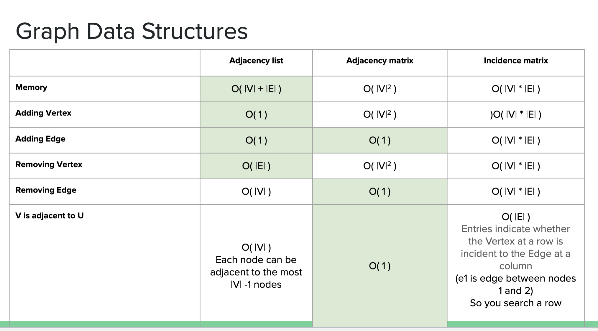

# Core Graph Definition
- Graph (V, E):
    - V: vertices (nodes)
    - E: edges (connections between nodes)
- Directed edge (u, v): u -> v
- Undirected edge (u, v): no direction, edges indicate two way travelling
- Directed Graph: all edges are directed
- Undirected Graph: all edges are undirected

# Graph Terminology
- Adjacent Vertices: share an edge
- Endpoints: If a is the edge between U and V, U and V are called a's endpoint
- Incident Edges: if a,b,c are edges with U as one of their endpoint, they're incident on U
- Degree (deg(v)): number of edges incident on/ connect to v
    - In directed graphs:
        - indeg(v): incoming edges
        - outdeg(v): outgoing edges
- Parallel Edges: multiple edges between same vertices
- Self-loop: edge from a vertex to itself
- Endpoints: If a is the edge between U and V, U and V are called a's endpoint

# Paths and Cycles:
- Path: Alternating sequence of vertices/ edges
- Simple Path: No repeats of vertices or edges
- Cycle: Path that begins and ends at same vertex
- Simple Cycle: Cycle with all vertices/ edges unique

# Graph Properties
## Undirected Graph
- Σ deg(v) = 2m (every edge counted twicce)
- Max edges (no self-loop/ parallel):
    - m ≤ n(n-1)/2

## Directed Graph
- Σ indeg(v) = Σ outdeg(v) = m 
- Max edges (no self-loop/ parallel):
    - m ≤ n(n-1)
- E ≤ V-1

# Graph ADT
1. Ancessors:
    - endVertices(e) -> get both ends of edge
    - opposite(v, e) -> get vertex on the other side of edge
    - isAdjacent(u, v) -> check if connected
2. Modifiers:
    - insertVertex(o)
    - insertEdge(v, w, o)
    - erateseVertex(v)
    - eraseEdge(e)
3. Iterators:
    - incidentEdges(v) -> edges connected to v
    - adjacentVertices(v) -> neighbors of v
    - vertices() list all nodes
    - edges() -> list all edges

# Time Complexity

1. Memory
- Adjacency List: O(|V| + |E|)
    - You store each vertext + lists of edges
    - Good when few edges
- Adjacent Matrix: O(|V|^2)
    - Always full square matrix, even if few edges
    - Good when many edges as you utilized all the table
- Incidence Matrix: O(|V| * |E|)
    - One row per vertex, one column per edge
    - Gets big fast
    
2. Adding a vertex
- Adjacent List: O(1) 
    - Just add a new node with an empty list 
- Adjacency Matrix: O(|V|^2) 
    - Add 1 new row and 1 new column to the grid. This resizing touches the whole matrix so grow like |V^2|
- Incidence Matrix: O(|V| * |E|)
    - You have to add a whole new row, which is as long as the number of edges

3. Adding an Edge
- Adjacency List: O(1)
    - Go to the node's list and append the connection
- Adjacency Matrix: O(1)
    - With indexing, it fast to access the row, col and update
- Incidence Matrix: O(|V| * |E|)
    - You need to add a how new column for the new edgre. Since every column touches all rows, it's V * E work

4. Removing a Vertex
- Adjacency List: O(|E|)
    - Remove the node
    - Look through all edges to delete everything connect to it. Worst case: touch every edge
- Adjacency Matrix: O(|V|^2)
    - You delete a row and a column in a grid. Since the grid is size V x V, it's heavy work
- Incidence Matrix: O(|V| * |E|)
    - You delete a row, but because it's a big table, this scales with both nodes and edges

5. Removing an Edge
- Adjacency List: O(|V|)
    - Worst case: you might check every neighbor in the list, so it's proportional to the number of nodes
- Adjacency Matrix: O(1)
- Incidence Matrix: O(|V| * |E|)

6. V is adjacent to U:
- Adjacency List: O(|V|)
    - You look through V's list to see if U is there. 
    - If V is connected to many nodes, you might check almost all of them
- Adjacency Matrix: O(1)
    - Just check `matrix[V][U]`
- Incidence Matrix:  O(|E|)
    - You have to looj through the edges to see if both V and U are connected by the same edge

# Question
1. Of the three data structures (Adjacency list, Adjacency matrix, and Incidence matrix), what would be the best memory footprint for a simple undirected graph with:
    - 10 Vertices and 15 Edges?
    - 2 Vertices and 1 Edges?

- V + E = 25; V * V = 100, V * E = 150 --> Adjacent Matrix
- V + E = 3; V * V = 4; V * E = 2 --> Incidence Matrix

2. Can an Adjacency Matrix ever use LESS memory than an Adjacency List in the worst case?
- No, the worst case memory footprint of an Adjacency Matrix cannot be smaller than Adjacency List
    - An adjacency list uses O(n + m) space, where n is the number of vertices and m is the number of edges
    - An adjacency matrix always uses O(n^2) space, because it creates an n x n grid, regardless of how many edges exist
- For a simple graph, the number of edges is always bounded by:
    - Unidrected: m ≤ n(n - 1)/2
    - Directed: m ≤ n(n - 1)
- So even in the worst case, m grows at most like n^2, making O(n + m) at most O(n^2) which = O(n^2) from matrix.

